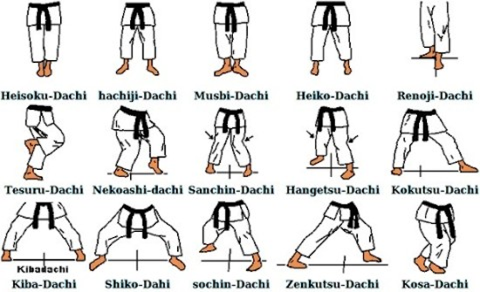

# Fußstände - Dachi  
  

# Weitere Techniken
Schlagtechniken - Uchi
Deckungen - Kamae  
Wurftechniken - Naga 
Fallschule - Ukemi  
Hebel - Kansetsu Waza  
Würgen - Shime Waza  
Atemi-Punkte - Tuite Waza  
Bodentechniken - Ne Waza  
Waffentechniken - Kubodu  
Ausweichbewegungen - Tai Sabaki 