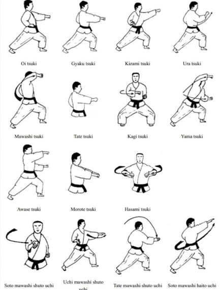
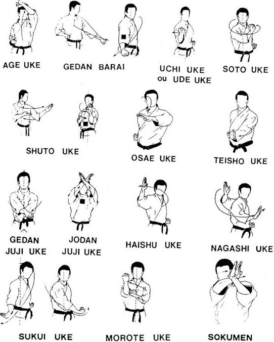
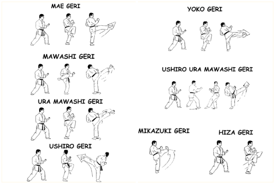

# Kihon
Grundlagen, Meditation in Bewegung, Partner-Übungen

## Grundtechniken
**Stoßtechnik - Tsuki**  

  

**Blocktechnik - Uke**  

  
  
**Fußtechnik - 	Geri**  

 

Schlagtechnik - Uchi
Deckung - Kamae  
Wurftechnik - Naga  
Stände - Dachi  

## Weitere Techniken
Fallschule - Ukemi  
Hebel - Kansetsu Waza  
Würgen - Shime Waza  
Atemi-Punkte - Tuite Waza  
Bodentechniken - Ne Waza  
Waffentechniken - Kubodu  
Ausweichbewegungen - Tai Sabaki  